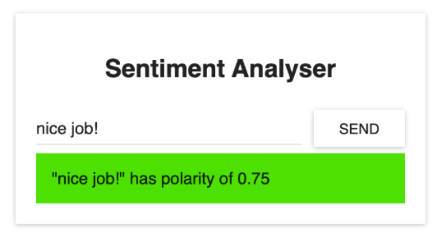

## Description
Practice orchestration of a microservice-based sentimental analysis application and run it successfully on Google Kubernetes Engine. This application accepts a sentence as input and it uses text analysis to calculate the emotion of the input sentence.


## App Structures
This application consists of the following microservices:
- SA-Frontend: a Nginx web server that serves our ReactJS static files.
- SA-WebApp: a Java Web Application that handles requests from the frontend.
- SA-Logic: a python application that performs Sentiment Analysis.

## Workflow

This interaction is best illustrated by showing how the data flows between them:
- A client application requests the index.html (which in turn requests bundled scripts of ReactJS application)
- The user interacting with the application triggers requests to the Spring WebApp.
- Spring WebApp forwards the requests for sentiment analysis to the Python app.
- Python Application calculates the sentiment and returns the result as a response.
- The Spring WebApp returns the response to the React app. (Which then represents the information to the user.)


## Steps to get the application to work on Google Kubernetes Engine (GKE)
1. First, I cloned the repo https://github.com/rinormaloku/k8s-masteryz to my local computer. 
2. Next, I did npm build and other prep steps mentioned in the 'freecodecamp' article. 
3. I did ```docker build``` and then ```docker push``` and pushed `sentiment-analysis-frontend`, `sentiment-analysis-web-app`, and `sentiment-analysis-logic` to my dockerhub.
4. After that, I created a cluster on the Google Kubernetes Engine.
5. I did ```gcloud container clusters get-credentials ...``` in the cloud shell to authorize my cloud shell. 
5. Then, I copied all the yaml files (especially deployment yaml and service yaml files) to the google cloud shell.
6. In the cloud shell, I did ```docker pull qiuyangz/sentiment-analysis-frontend:minikube ``` to pull the containers from my dockerhub and then do ```docker tag ``` and ```docker push``` to push the sentiment-analysis-frontend to the Google Container Registry.
7. Then, I did ```docker pull qiuyangz/sentiment-analysis-web-app:latest ``` to pull and then did ```docker tag ``` and ```docker push``` to push the sentiment-analysis-web-app to the Google Container Registry.
8. Similarlym I did ```docker pull qiuyangz/sentiment-analysis-logic:latest``` to pull and then did ```docker tag ``` and ```docker push``` to push the sentiment-analysis-logic to the Google Container Registry.
9. After pushing all these to container registry, I modified the deployment yaml files accordingly and updated the `image` field to point to the corresponding container registry. For example, the `image` field in sa-frontend-deployment.yaml is updated to `gcr.io/amazing-autumn-398923/qiuyangz/sentiment-analysis-frontend:minikube`. Did this for the other two as well. This was clearly shown in the Code Changes video below. 
10. After making changes to the yaml files, I did ```kubectl apply -f sa-frontend-deployment.yaml --record```,  ```kubectl apply -f sa-web-app-deployment.yaml --record```, and ```kubectl apply -f sa-logic-deployment.yaml --record``` to create pods.
11. Then I did ```kubectl apply -f service-sa-frontend-lb.yaml```, ```kubectl apply -f service-sa-web-app-lb.yaml```, and ```kubectl apply -f service-sa-logic.yaml``` to expose these pods as services. 
12. I accessed these services through the `Services & Ingress` tab in the Google Cloud Console and got sa-web-app-lb load balancer IP, which is `35.223.87.234:80`. 
13. Then I pasted this into `sa-frontend/src/App.js` and updated the request url, making sure the fetch request was sent to `35.223.87.234:80`.
14. Then, I did `npm run build` and then ```docker build``` and after that ```docker push``` to update the image in Docker hub. 
15. After that, I did ```docker pull qiuyangz/sentiment-analysis-frontend:minikube ``` to pull again and ```docker tag ``` and ```docker push``` to push the sentiment-analysis-frontend to the Google Container Registry.
16. Finally, I tried to do  ```kubectl apply -f sa-frontend-deployment.yaml --record``` to update the deployment of frontend since I updated the url there. But the first time didn't work. I did ```kubectl delete deployment sa-frontend``` and then applied again by ```kubectl apply -f sa-frontend-deployment.yaml --record``` and it worked. 
17. Opened the endpoint to sa-frontend-lb and typed the sentence. It displayed the polarity score!


## URLs to the Docker Hub images used 
**sentiment-analysis-frontend**:  https://hub.docker.com/r/qiuyangz/sentiment-analysis-frontend

**sentiment-analysis-web-app**: https://hub.docker.com/r/qiuyangz/sentiment-analysis-frontend

**sentiment-analysis-logic**: https://hub.docker.com/r/qiuyangz/sentiment-analysis-logic

## Demo
https://youtu.be/MBRYW97ctWI

## Code changes
https://youtu.be/sU71vl_3P68

## Reference
https://github.com/rinormaloku/k8s-mastery

https://www.freecodecamp.org/news/learn-kubernetes-in-under-3-hours-a-detailed-guide-to-orchestrating-containers-114ff420e882